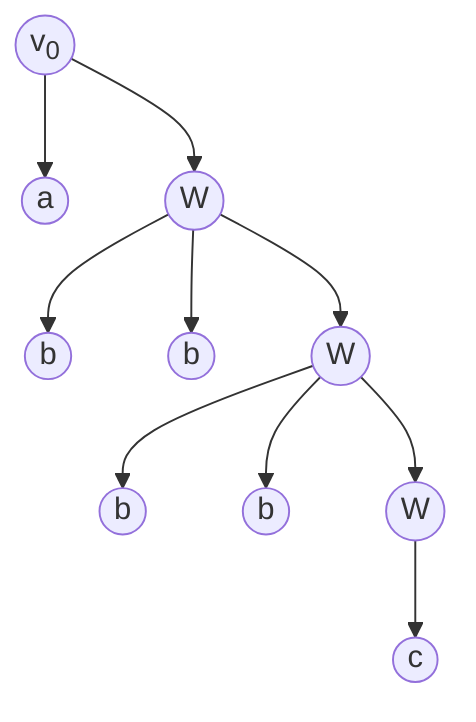

# 形式语言

## 语言的定义

Chomsky 认为，语言是按照一定**规律**构成的**句子**和**符号串**的有限或无限的集合。

在形式语言理论中，**形式语言**是一个字母表上的某些有限长字符串的**集合**。一个形式语言可以包含无限多个字符串。

## 语言描述

不像自然语言，一个形式语言作为一个集合，需要有某种明确的标准来定义一个字符串是否是它的元素。

- **穷举法**：只适合句子数目有限的语言。
- **语法描述**：通过有限的替换规则，**生成**语言中合格的句子。
- **自动机**：对输入的句子进行**检验**，区别哪些是语言中的句子，哪些不是语言中的句子

### 基本概念

- 设 _V_ 是有限集合，其中元素称为 “**字符**”。
- 由 _V_ 中字符相连而成的**有限**序列称为 “**字符串**”。
- 不含任何字符的串成为 “**空串**”，记作 $\varepsilon$。
- 字符串所包含的字符个数称为 “**长度**”，记作 $|s|$, $|\varepsilon|=0$。
- 包括空串的 _V_ 上的字符串**全体**记作 $V^*$。
- 字符串**连接**：$s=ab,t=gg$ 连接 $st=abgg$。 -字符串**n 次幂**：$s$ 自身连接 n 次，$s^0=\varepsilon$。
- **乘积**：$AB=\left\{ st|s\in A,t\in B \right\}$
- **幂运算**：$A^0=\left\{\varepsilon\right\}, A^n=A^{n-1} A=AA^{n-1}$
  - 例子：$A=\left\{aa,bb\right\},B=\left\{cc,dd,ee\right\}$
  - $AB=\left\{aacc,aadd,aaee,bbcc,bbdd,bbee\right\}$
  - $A^2=\left\{aaaa,aabb,bbaa,bbbb\right\}$
- **闭包**：$A^*=A^0\bigcup A^1\bigcup A^2...$
- **正闭包**：$A^+=A^1\bigcup A^2...=A^* - \{\varepsilon\}$

### 正则表达式 Regular Expression

正则表达式是一种描述语言（也就是字符串的集合 $V^*$)的方式。

- RE1：$\varepsilon$ 是正则式，对应正则集 $\{\varepsilon\}$
- RE2：$x \in V，x$ 是正则式，对应正则集 $\{x\}$
- RE3：如果 $\alpha、\beta$ 是正则式，则 $\alpha\beta$ 是正则式，对应正则集 $AB$ （字符串集合乘积）
- RE4：如果 $\alpha、\beta$ 是正则式，则 $(\alpha|\beta)$ 是正则式，对应正则集 $A \bigcup B$
- RE5：如果 $\alpha$ 是正则式，则 $(\alpha)^*$ 是正则式，对应正则集 $A^*$

#### 正则表达式对应字符串集合

V 上的正则表达式对应和描述了 $V^*$ 的一个子集（正则子集）

例：$V=\{a,b\}$,下列正则表达式：

$$
ab^*b\text{描述了}\{ab,abb,abbb,...\}
\\
ab^*\text{描述了}\{a,ab,abb,abbb,...\}
\\
a^*b^*\text{描述了}\{\varepsilon,a,b,ab,aab,abb,...\}
\\
(ab)^*\text{描述了}\{\varepsilon,ab,abab,ababab,...\}
$$

### 短语结构语法 Phrase Structure Grammar

短语结构语法也是一种描述语言的方式。

短语结构语法是一个四元组 $G=<V,S,v_0,\vdash>$。

- V 是**字符集**
- $S\subseteq V$,称为**终结符**，$N=V-S$称为**非终结符**
- $\vdash$ 称为**产生式关系**，由 $w\vdash w'$ 这样的**产生式**（二元组）构成，表示 $w$ 可以替换成 $w'$，$w,w'$ 分别称为左部和右部
- $v_0 \in N$,称为**初始符**（句子符），是替换的起点
- 直接导出关系($x\rightarrow y$)定义为：$x=lwr,y=lw'r,\text{且} \ w \vdash w'\text{是产生式},l,r \in V^*$
- 关系的**传递闭包**为 $\rightarrow ^\infin$

$w \in S^*$ 是语法正确的句子当且仅当 $v_0\rightarrow ^\infin w$。

#### 示例：导出语言句子

终结符 $S=\{\text{张三，李四，深情地，狂野地，歌唱，奔跑}\}$

非终结符 $N=\{\text{<句子>，<主语>，<谓语>，<动词>，<副词>}\}$

产生式关系：

- <句子> $\vdash$ <主语><谓语>
- <主语> $\vdash$ 张三；<主语> $\vdash$ 李四
- <谓语> $\vdash$ <副词><动语>
- <副词> $\vdash$ 深情地；<副词> $\vdash$ 狂野地
- <动词> $\vdash$ 歌唱；<动词> $\vdash$ 奔跑

直接导出关系生成句子：

- <句子>
- $\rightarrow$ <主语><谓语>
- $\rightarrow$ 张三<谓语>
- $\rightarrow$ 张三<副语><动词>
- $\rightarrow$ 张三<副语>奔跑
- $\rightarrow$ 张三狂野地奔跑
- 传递闭包：<句子> $\rightarrow ^\infin$ 张三狂野地奔跑
- 张三狂野地奔跑是符合**语法 G 的句子**

> 终结符是一个形式语言的基本符号，不能被分解为更小的单位。确切的说，一个语法的规则不能改变终结符。一个形式语法所推导的形式语言必须完全由终结符组成。
>
> 非终结符是可以被取代的符号。一个形式文法中必须有一个起始符号，这个起始符号属于非终结符的集合。在上下文无关文法中，每个推到规则的左边只能有一个非终结符而不能有两个以上的非终结符或中介符。

#### 语法产生的语言

利用语法 $G$ 产生的所有的正确构造的句子的集合称为 $G$ 的语言，记作 $L(G)$。

不同的语法可能产生不同的语言，也可能产生相同的语言。

#### 导出树 dervation tree

可以使用多元有向树表示**语言导出过程**。

- 起始符 $v_0$ 作为树根
- 每个子树的**树根**是生成式的**左部**
- **子节点**分别是生成式**右部**包含的符号
- 适合**所有**产生式的左部**仅有一个非终结符**情形

示例：

$V=\{v_0,w,a,b,c\},S=\{a,b,c\}\\$
产生式：$v_0 \vdash aw;\ w \vdash bbw;\ w \vdash c;\\$
$L(G) \subseteq S^*$

对应的正则表达式 $a(bb)^*c$。
