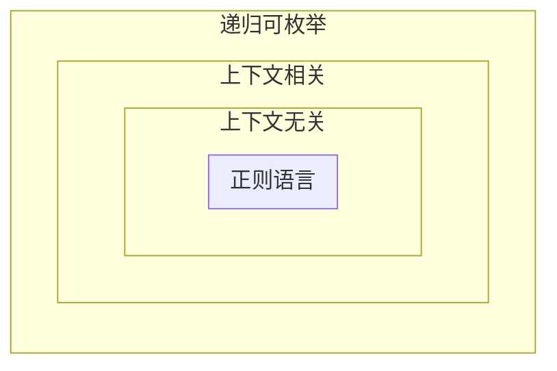

# 乔姆斯基形式文法分类

对于短语结构文法 $G$,讨论其产生式集合。

## 0-型文法--无限制文法

0-型文法（Phrase Structure Grammer(PSG)），也称为无限制文法或短语结构文法,**对产生式没有任何约束或限制**。它包括所有的文法，产生的语言称为**递归可枚举语言**，该类型的文法产生的语言可被**图灵机**识别。

## 1-型文法--上下文相关文法

1-型文法（Context Sensitive Grammer(CSG)），也称为上下文相关文法，这种文法的产生式形如 $\alpha A \beta \vdash \alpha \gamma \beta$，A 是非终结符，$\alpha\ \beta\ \gamma$ 是任意串，但 $\beta$ 不能是空串。这种文法规定的语言可以被**线性有界非确定图灵机**识别。

## 2-型文法--上下文无关文法

2-型文法（Context Free Grammer(CFG)），也称为上下文无关文法，这种文法的产生式形如 $A \vdash \gamma$，A 是非终结符，$\gamma$ 是包含非终结符号与终结符号的字符串。这种文法规定的语言可以被**非确定下推自动机**接受。上下文无关语言为大多数**程序设计语言**的文法提供了理论基础。

## 3-型文法--正则文法

3-型文法（Regular Grammer(RG)），也称为正则文法，这种文法要求产生式的左部只能包含**一个**非终结符号，产生式的右部最多有**一个**非终结符，且只能在**最右端**。这种规定的语言可以被**有限状态自动机**接受，也可以**通过正则表达式**来获得。正则语言通常用来定义检索**模式**或者程序设计语言中的**词法**结构。

| 文法 | 语言           | 自动机               | 产生式规则                                  |
| ---- | -------------- | -------------------- | ------------------------------------------- |
| 0-型 | 递归可枚举语言 | 图灵机               | $\alpha \vdash \beta$                       |
| 1-型 | 上下文相关语言 | 线性有界非确定图灵机 | $\alpha A \beta \vdash \alpha \gamma \beta$ |
| 2-型 | 上下文无关语言 | 非确定下推自动机     | $A \vdash \gamma$                           |
| 3-型 | 正则语言       | 有限状态自动机       | $A \vdash aB \\ A \vdash a$                 |

# 语法分析 Parsing

语法分析是语言导出的**逆**过程，从一个**句子**得到**导出树**或导出过程，涉及到对句子**结构**的分析。在程序设计语言的编译中有重要的应用。
