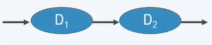

# BNF（Backus-Naur Form）范式

BNF 是一种可以用来表示上下文无关文法或正则文法的方式，BNF 规定是推导规则(产生式)的集合，写为：

> <符号> ::= <使用符号的表达式>

符号对应的关系为：

- "::=" --> “定义为”
- "|: --> “或”
- "<>" --> 包含非终结符，没有使用 <> 修饰的符号是终结符
- BNF 产生式左部仅有**一个**非终结符

## BNF 示例

中文句子

- <句子>::=<主语><谓语>
- <主语>::=张三|李四
- <谓语>::=<副词><动词>
- <副词>::=深情地|狂野地
- <动词>::=歌唱|奔跑

a(bb)\*c

- <$v_0$>::=a\<w\>
- \<w\>::=bb\<w\>|c

递归出现一次，并在最右，称为**正规**的。

## 扩展 BNF(Extended Backus–Naur Form)

| 用途         | 符号表示 |
| ------------ | -------- |
| 定义         | =        |
| 串接         | ,        |
| 终止         | ;        |
| 分隔         | \|       |
| 可选         | [ ... ]  |
| 重复         | { ... }  |
| 分组         | ( ... )  |
| 双引号       | " ... "  |
| 终结符单引号 | ' ... '  |
| 注释         | (_..._)  |
| 特殊序列     | ? ... ?  |
| 除外         | -        |

示例

> integer = "0" | [ "-" ] , natural number ;

integer 是一个零(0)或可能前导可选的负号的一个自然数

## 语法图 Syntax Diagram

语法图（Syntax diagrams ）又叫铁路图（railroad diagrams）是描述形式文法的一种方式。它是巴科斯范式或扩展巴科斯范式的图形化表示。

规则：

- 一个语法的表示法是由**一套语法图**组成，每个图定义了**一个非终结符**
- 终结符用**圆形**区域表示，同时非终结符用**方形**区域表示
- 每个图都有一个起始点和一个终点

结构：

- 顺序结构（连接）
- 可选分支结构（BNF 或）
- 循环结构（非终结符递归）

示例：

<$v_0$>::=a\<w\>

## 正则集合与正则语法

$S$ 是有限集合，$L\subseteq S^*$，则 $L$ 是正则集合，当且仅当对某个正则语法，有 $L=L(G)$，那么我们可以从正则语法 $G$ 构造对应正则集合的正则表达式（而正则表达式对应正则集合）。将 $G$ 的语法组合为一个大图，其中仅包含 $v_0$ 和终结符，称作主导图（master diagram）。

### 主导图翻译成正则表达式

- 串联子图，对应子表达式 $\alpha_1 \alpha_2$
- 并联子图，对应子表达式 $\alpha_1 | \alpha_2$
- 回路子图，对应子表达式 $\alpha^*$

串联子图

并联子图

回路子图

