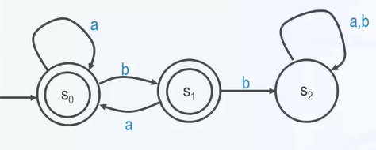

# 有限状态机

有限状态机（finite-state machine，FSM），是表示**有限个**状态以及在这些状态之间的**转移和动作**等行为的数学计算模型。

**状态存储关于过去的信息**，就是说：它反映从系统开始到现在时刻的输入变化。转移指示状态变更，并且用必须满足确使转移发生的条件来描述它。

## 数学描述

有限状态机是一个五元组 $M(A,S,Y,s_0,F)$。

- $A$：**输入**字符串的**字母**表
- $S$：机器的有限**状态**集合
- $Y \subseteq S$：被称作“接受”的状态集合
- $s_0 \in S$：**初始**状态
- $F:S * A \rightarrow S$：**状态转移函数**，指明在某个状态下接受输入字符所引起的状态转移

### 示例

1. A={a,b}
2. $S=\{s_0,s_1,s_2\},\ Y=\{s_0,s_1\},s_0$ 初始状态
3. F 如下表：

|   F   |   a   |   b   |
| :---: | :---: | :---: |
| $s_0$ | $s_0$ | $s_1$ |
| $s_1$ | $s_0$ | $s_2$ |
| $s_2$ | $s_2$ | $s_2$ |

## 状态图

FSM 通常用状态图来表示，状态图 $D=D(M)$ 是边带**标记**的**有向图**。

- 节点为状态，转移函数决定边的走向和标记
- 接受状态用**双圈**表示
- 边的定义：如果 $F(s_j,a)=s_k$,则从节点 $s_j$ 做标记 到 $a$ 的有向边到节点 $s_k$
- 初始状态 $s_0$ 用一个特殊的无源箭头标识

示例：赋权有向图

## 机器识别的语言

机器 $M$ 所识别的 $A$ 的所有字符串 $w=a_1a_2...a_m \in A^*$，其中 $F(s_{i-1},a_i)=s_i$,也就是确定拟路径 $P=(s_0,a_1,s_1,a_2,s_2...,a_m,s_m)$,如果 $s_m \in Y$ 则称 M **识别或接受** w。

## 正则语言和有限状态机

Kleen 定理：字母表 A 上的形式语言 L 是正则的当前仅当存在一个有限状态机 M 是的 L=L(m)。
