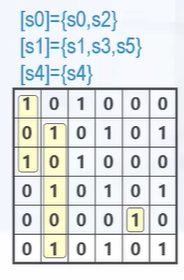
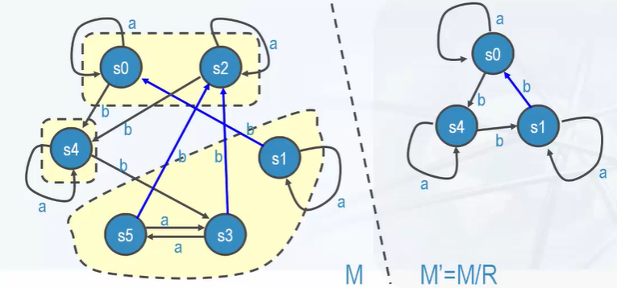

# 商机器

## 机器同余（machine congruence）

机器同余是一个**等价关系** R。

在有限状态机 M(A,S,F) 的状态集合 S 上的等价关系 R，对于任意的 $s,t \in S$，如果 $sRt$,能导出对于任意的输入符号 $x \in A$, 都有 $F(x,s)RF(x,t)$。即同一个等价类的状态对于任意的输入都转移到属于同一个等价类的状态。

## 商机器 quotient machine 的定义

相对于有限状态机 M(A,S,F) 和 M 上的机器同余 R，定义 $S'=S/R=\{[s]|s\in S\}$是 S 关于等价关系 R 的商集，$F'=\{<[s],[F(x,s)]>|s \in S,x \in A\}$，则 $M'(A,S',F')$ 称为 M 关于 R 的**商机器** M/R。

通常商机器比原来的机器简单一些，是机器化简的基础。

### 示例

#### 示例一

1. $A=\{a,b\},S=(s_0,s_1,s_2,s_3,s_4,s_5)$，F 如表。
2. S 商等价关系 R 的关系矩阵如图。

|   F   |   a   |   b   |
| :---: | :---: | :---: |
| $s_0$ | $s_0$ | $s_4$ |
| $s_1$ | $s_1$ | $s_0$ |
| $s_2$ | $s_2$ | $s_4$ |
| $s_3$ | $s_3$ | $s_2$ |
| $s_4$ | $s_4$ | $s_3$ |
| $s_5$ | $s_3$ | $s_2$ |

那么商机器如下：

|   F'    |    a    |    b    |
| :-----: | :-----: | :-----: |
| $[s_0]$ | $[s_0]$ | $[s_4]$ |
| $[s_1]$ | $[s_1]$ | $[s_0]$ |
| $[s_2]$ | $[s_2]$ | $[s_4]$ |

#### 示例二：状态图

## 商机器性质

由拥有相容性质的机器同余，所构造的商机器 M/R：

- 从初始状态开始，对任何字符串与原机器做出的是否接受结论是相同的
- M 和商机器 M/R 识别相同的语言
- 由于商机器状态不多与原机器，M/R 即 M 简化的结果

## 机器化简

相容关系 R 的迭代算法：

1. S 的初始划分 $P_0=\{Y,Y~\}$
2. 假设目前已有划分 $P_k=\{S_1,S_2,...S_m\}$，考察每个等价类 $S_i$
3. 如果 $S_i$ 中两个状态 s,t 在所有的输入 x 作用下都转移到）**同一个**状态分块 $A_j$（取决于 x），则据此构造 $S_i$ 的进一步细分
4. 将所有 $S_i$ 的细分合在一起，成为新的划分 $P_{k+1}$
5. 如果 $P_{k+1}=P_k$ ,算法停止，否则回到第二部
6. 根据 R 构造商机器 M/R 即为化简结果
