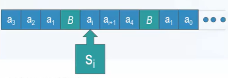

# 图灵机

## 图灵机基本结构

- 一条**分格**的**无限长**的**纸带**，每格可容纳一个字符
- 一个**读写**头，可以在纸带上**移动**，**读出**当前各自的字符，**重写**格子上的内容，改变自己的内部**状态**
- 一系列关于读写头动作的**规则**（程序、状态转移函数）
- 纸带上的内容（包括空白 B）是计算前的**输入**和计算完成后的**输出**
- 计算从读写头的**初始状态** $s_0$、**初始位置**和**输入**的纸带格局开始
- 按照规则进行读写头的**移动**、纸带字符的**修改**，直到进入**停机**状态$(S_H/S_Y/S_N)$
- 在停机状态时纸带的内容就是输出

## 计算规则

状态转移函数：$\delta:Q\times\Gamma\rightarrow Q\times\Gamma\times\{L,R,N\}$($\Gamma$ 是字符集，Q 是非空有穷状态集合)

每个五元组为一条规则：$q=<s_i,a_k,a_l,s_j,d>$，$s_i,s_j \in S(\text{内部状态}),a_k,a_l\in A(\text{纸带字符}),d\in\{L,R,N\}(\text{左移，右移，不动})$，表示如果读写头**当前状态**为 $s_i$，读到**当前格子**字符为 $a_k$，则：

1. 改写格子内容为 $a_l$
2. **转变状态**为 $s_j$
3. **进行** d 指定的动作（读写头左移、右移或不动）

### 计算规则的限制

1. 规则数量**有限**
2. 保证动作的**确定性**：任意两条规则前两项不能相同
3. 没有规则的第一项是 $S_H/S_Y/S_N$，保证这三个状态是**停机**状态

## 形式语言与图灵机

当 $W \subseteq A^*$, 将 W 中的任意字符串 w 作为输入，图灵机 M 都停止在**接受**状态 $S_Y$，而 A-W 中的所有字符串， M 停止在**拒绝**状态 $S_N$ ，或者**用不停机**，则称 M **接受/识别**语言 W=L(M)。形成语言 L 能被图灵机识别，当且仅当 L 是一个 0-型语言。

## 图灵机变种

图灵机的变种有多纸带图灵机、双向图灵机等等，其中比较特别的一种是非确定性图灵机。

非确定性图灵机的前两项可以**相同**，机器**任意**选择一个分支进行，但规则必须一致，禁止一个分支导致接受而另一个分支导致拒绝。

## 识别和判定

识别和判定与停机问题相关。

**识别**：属于语言的串在有限步被接受，不属于语言的串被拒绝或永不停机。

**枚举**：枚举生成所有属于语言的串，对于无限集合语言，这个生成过程可能永不停止。

**可识别 == 可枚举**

判定：属于语言的串被**接受**，且不属于语言的串被**拒绝**，不存在永不停机的可能。只有 **L** 和 L 的**补语言**都是图灵可识别的情况下，L 才是图灵可判定的。

存在语言是图灵机可识别但不可判定的。
