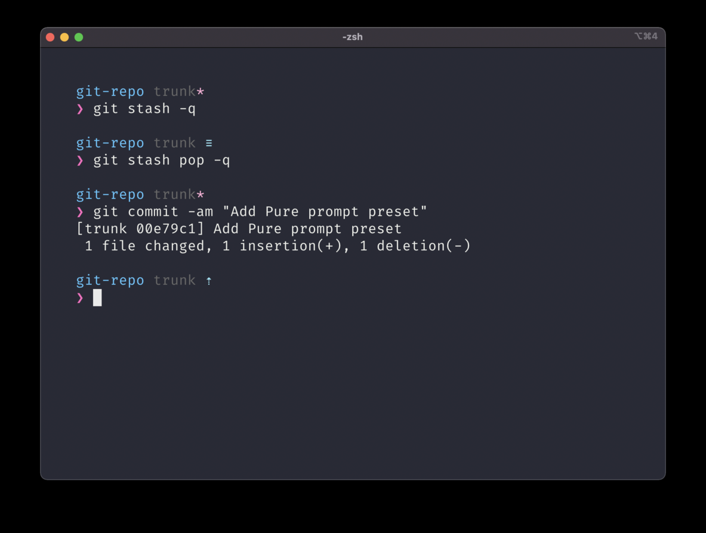

## 介绍

[Oh My Zsh](https://ohmyz.sh/) 是一个开源的、社区驱动的框架，用于管理你的 Zsh 配置。它捆绑了数以千计的有用功能、插件和主题。但我并不打算用 Oh My Zsh 的主题，而是使用 [Starship](https://starship.rs/guide/#%F0%9F%9A%80-installation) 作为 Zsh 的主题。使用 Starship 的好处包括但不限于快速、可定制、通用和智能等，我这里看重的是它的通用性，我的 PowerShell、Bash 和 Zsh 都是使用 Starship。

## 安装之前

在安装 Oh My Zsh 和 Starship 之前，需要先安装 zsh 和 [Nerd Font](https://www.nerdfonts.com/)。

### 安装 Zsh

大部分 Linux 系统的软件源里都有 Zsh，直接用命令安装就行。

```Shell
# Fedora/CentOS/RedHat
sudo dnf -y install zsh
# Debian/Ubuntu/Mint
sudo apt-get -y install zsh
# Arch Linux
sudo pacman -S zsh
```

### 切换 Zsh

```Shell
# 查看系统预设 Shell。
cat /etc/Shells
# 切换到 Zsh。
chsh -s /bin/zsh
```

需要退出才能生效，建议在安装完成 Oh My Zsh 后再退出。

### 安装 Nerd Font

[Nerd Font](https://www.nerdfonts.com/) 常用来在终端下显示各种图标。在[下载](https://www.nerdfonts.com/font-downloads)页面选择需要的字体下载安装即可，建议 FiraCode Nerd Font。

## 安装 oh-my-zsh

使用下面其中一条命令即可，需要使用代理软件。如果没有代理，使用第三条命令，它使用 gitee 的源。

```Shell
sh -c "$(curl -fsSL https://raw.github.com/ohmyzsh/ohmyzsh/master/tools/install.sh)"

sh -c "$(curl -fsSL https://raw.githubusercontent.com/ohmyzsh/ohmyzsh/master/tools/install.sh)"

sh -c "$(curl -fsSL https://gitee.com/shmhlsy/oh-my-zsh-install.sh/raw/master/install.sh)"
```

安装完成后就可以重启终端。

## 安装并配置 Starship

其实在 [Starship](https://starship.rs/guide/#%F0%9F%9A%80-installation) 的文档里有详细的安装说明。在这里以 Linux 为例。

### 安装 StarShip

```Shell
curl -sS https://starship.rs/install.sh | sh
```

### 配置 Starship

在 Zsh 中启用 Starship,在 `~/.zshrc` 添加以下配置：

```bash
eval "$(starship init zsh)"
```

配置完成后就可以重启终端，也可以选择更新配置。

```Shell
source ~/.zshrc
```

这时就可以看到 Starship 的效果了。

### 使用 Starship 的预设

Starship 提供了几种[预设主题](https://starship.rs/presets/#nerd-font-symbols)，在这里我使用的是 `Pure Preset` 。

```Shell
starship preset pure-preset > ~/.config/starship.toml
```

更新配置或者重启终端即可看到效果。



## 配置 Oh My Zsh

最后，配置一下 Oh My Zsh 的插件，需要修改 ~/.zshrc 配置文件中的 plugins 配置段，这些插件储存在目录 `~/.oh-my-zsh/plugins` 中。

有些插件需要单独下载，我这里是 `zsh-autosuggestions`。

```Shell
git clone https://github.com/zsh-users/zsh-autosuggestions ${ZSH_CUSTOM:-~/.oh-my-zsh/custom}/plugins/zsh-autosuggestions
```

下载后在配置文件的 `plugins` 选项的最后面添加自己的需要使用插件即可，我使用的插件如下：

```bash
plugins=(git history history-substring-search node npm last-working-dir zsh-autosuggestions)
```

### 颜色风格

有时 `zsh-autosuggestions` 插件的提示颜色看不清，可以通过修改颜色处理。打开配置文件 `~/.oh-my-zshcustom/plugins/zsh-autosuggestions/zsh-autosuggestions.zsh` 修改以下配置项

```Shell
typeset -g ZSH_AUTOSUGGEST_HIGHLIGHT_STYLE='fg=12'
```
